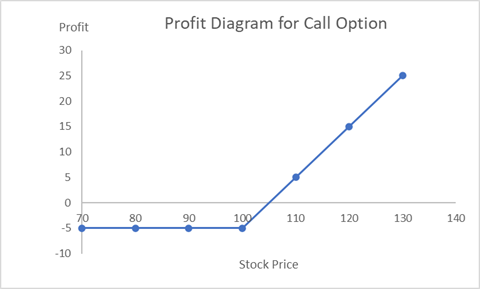
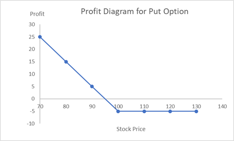

# Introduction
This markdown file introduces the basic concepts of options.

## Derivative
Derivatives are financial contracts whose value depends on underlying assets such as gold or stocks.
They can be traded between parties for both hedging risk and speculative purposes.  

There are two main types of financial derivatives: lock and option.
Lock products such as forwards and futures are obligatory to transact, while options give the holder the right, but not the obligation to transact.

## Types of Options
**Call Option** --- Gives the holder the right to **buy** the underlying asset at a specified exercise (strike) price.  
**Put Option** --- Gives the holder the right to **sell** the underlying asset at a specified exercise (strike) price.  
**American Option** --- Can be exercised **anytime on or before** the maturity date.  
**European Option** --- Can be exercised **only on** the maturity date.

## Example
### Speculation Example
An investor speculates that a stock currently worth $10 per share will rise over the next month. So, the investor buys a **call** option that gives the right to buy the stock at $10 per share with premium (price of the contract) $2 per share.

Suppose the stock rises to $20 before expiration, the investor can exercise the option and buy 50 shares at the locked-in price $10 per share.
Subtracting the premium and other fees, the investor earns approximately $400 net profit.

### Hedging Example
Suppose an investor owns 50 shares of a stock currently worth $20 per share and plans to sell them next month. However, the investor is concerned that the price may fall.
To hedge this risk, the investor buys a **put** option that gives the right to sell the stock at $20 per share with premium $2 per share.

If the stock price falls to $10, the investor can exercise the option and sell the 50 shares at the locked-in price $20 per share.
By doing so, the investor pays only the $100 premium instead of losing $500.

## Profit Diagrams
Profit diagrams illustrate the profit or loss of an option based on the stock price.  
For a **call option**, we want the exercise price $E$ to be lower than the market price $S$, so we can buy the stock at a discount.  
If the market price is below the exercise price, we simply let the option expire, losing only the price of option (premium).

The payoff is $`\text{max}(0, S - E)`$ and the profit is $`\text{Payoff}-\text{Premium}`$.

The figure below shows a profit diagram for a call option with a $5 premium and a $100 exercise price.

For a **put option**, we want the exercise price to be higher than the market price, so we can sell the stock at a premium.

The payoff is $`\text{max}(0, E - S)`$ and the profit is $`\text{Payoff} - \text{Premium}`$.

The figure below shows a profit diagram for a put option with a $5 premium and a $100 exercise price.

