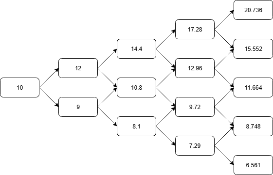

# Introduction
This markdown file explains the concept and code for the binomial option pricing model.

## Asset Valuation
The valuation of any asset is based on the **present value of its future cash flows**. Options are no different.

In the **binomial option pricing model**, the premium is calculated as the expected payoff under given probabilities and discounted at the risk-free rate:

$$
\text{Option Price} = \frac{\mathbb{E}[\text{Payoff}]}{(1+r)^n}
$$

## Assumptions in the Binomial Option Pricing Model
1. There are only two possible price movements for the underlying asset at each step.
2. Prices move either up or down by fixed percentages.
3. The underlying asset does not pay dividends.
4. The risk-free interest rate is constant.
5. No taxes or transaction costs.
6. Investors are risk neutral.

## Example
1. Current stock price is $10.
2. Exercise price is $10.
3. Stock price changes twice in 6 months.
4. Percentage of upward movement is 20% and percentage of downward movement is 10%.
5. Probability of downward movement is 40%.
6. Risk-free interest rate is 8% per annum.

We need to find the premium for a **European call and put option** that matures in 1 year.

Since there are 2 changes in 6 months, there will be **4 changes in 1 year**.

Step 1: First change  
Upward price: $`\$10 \times 1.2 = \$12`$  
Downward price: $`\$10 \times 0.9 = \$9`$  
Probability: 0.6 upward, 0.4 downward

Step 2: Second change  
For $12, the upward price is $14.4 and the downward price is $10.8.  
For $9, the upward price is $10.8 and the downward price $8.1.  
Probabilities:  
$14.4: $`0.6 \times 0.6 = 0.36`$  
$8.1: $`0.4 \times 0.4 = 0.16`$   
$10.8: $`2 \times 0.6 \times 0.4 = 0.48`$

The figure below shows the binomial tree of 4 changes.



For **call option**, we exercise the option when the market price exceeds $10; otherwise, it expires worthless.

Expected payoff:

$$
\mathbb{E}[\text{Payoff}] = (10.736 \times 0.1296) + (5.552 \times 0.3456) + (1.664 \times 0.3456) + (0 \times 0.1536) + (0 \times 0.0256)
= 3.8852352
$$

Discounting at effective interest rate $`0.08 \div 4 = 0.02`$, the premium of the call option is:

$$
\text{Premium} = \frac{3.8852352}{(1+0.02)^4} = \$3.5894
$$

For **put option**, we exercise the option when the market price is below $10; otherwise, it expires worthless.

Expected payoff:

$$
\mathbb{E}[\text{Payoff}] = (0 \times 0.1296) + (0 \times 0.3456) + (0 \times 0.3456) + (1.252 \times 0.1536) + (3.439 \times 0.0256)
= 0.2803456
$$

The premium of the put option is:

$$
\text{Premium} = \frac{0.2803456}{(1+0.02)^4} = \$0.2590
$$

## Implementation in C++
In the `.cpp` file, we define a class `BOPM` with a constructor that initializes the parameters, a `buildTree()` function to construct the binomial model,
an `exportCSV()` function to export the model to a CSV file, `callPrice()` and `putPrice()` functions to calculate the option premiums,
and a `printResults()` function to display the option payoffs.

The most crucial part of the implementation is building an algorithm to compute the prices and probabilities at each step. It turns out that the probabilities follow a binomial pattern, hence the name binomial model.

To compute the price of the underlying asset at each step, we only need the initial stock price and the percentages of upward and downward changes. For example,
if we want to know the possible prices after the third price change, there will be four possible values.
1. The stock price increases three times:  
    $`\$10 \times 1.2^3 = \$17.28`$
2. The stock price increases twice and falls once:  
    $`\$10 \times 1.2^2 \times 0.9 = \$12.96`$
3. The stock price increases once and falls twice:  
    $`\$10 \times 1.2 \times 0.9^2 = \$9.72`$
4. The stock price falls three times:  
    $`\$10 \times 0.9^3 = \$7.29`$

Here we can observe that the only changing elements in the formula are the exponents of the upward and downward movements. Thus, the general formula is:
```cpp
priceTree[i][j] = S0 * std::pow(1 + UpChange, static_cast<double>(i - j)) * std::pow(1 - DownChange, static_cast<double>(j));
```
where `i` represents the number of upward changes and `j` represents the number of downward changes.

To determine the probability of each possible price, we use the probability of movement. However, there is a subtle issue that must be addressed.
There are three possible paths for the price to increase twice and fall once:
1. up, up, down
2. up, down, up
3. down, up, up

In the above example, there is only one path to reach $17.28 and $7.29, but three paths to reach $12.96 and $9.72. After several steps, it can be observed that
the tree follows Pascal's triangle, which represents binomial coefficients. Hence, the formula to calculate the probabilites of each price is:
```cpp
probTree[i][j] = binomialCoeff(i, j) * std::pow(probUp, static_cast<double>(i - j)) * std::pow(1 - probUp, static_cast<double>(j));
```

Below is an example of the implementation parameters:
```cpp
// parameters
double initialPrice = 10.0;
double nextStepUpPrice = 12.0;
double nextStepDownPrice = 9.0;
double probUp = 0.60;
double frequencyPerYear = 4.0;
double maturityInYear = 1.0;
double strike = 10.0;
double riskFreeRatePA = 0.08;
```

Sample output:

```text
The output is successfully exported to bopm_output.csv

Call Option
    Final Price         Payoff    Probability
        20.7360        10.7360         0.1296
        15.5520         5.5520         0.3456
        11.6640         1.6640         0.3456
         8.7480         0.0000         0.1536
         6.5610         0.0000         0.0256

The price of the Call option is 3.5894

Put Option
    Final Price         Payoff    Probability
        20.7360         0.0000         0.1296
        15.5520         0.0000         0.3456
        11.6640         0.0000         0.3456
         8.7480         1.2520         0.1536
         6.5610         3.4390         0.0256

The price of the Put option is 0.2590
```

## Final words
This implementation assumes **European-style options**, which can only be exercised on the maturity date.

The **binomial option pricing model** is simple, efficient, and widely used for educational purposes. However, it is not fully realistic for real-world pricing since it assumes only two possible outcomes at each step.
